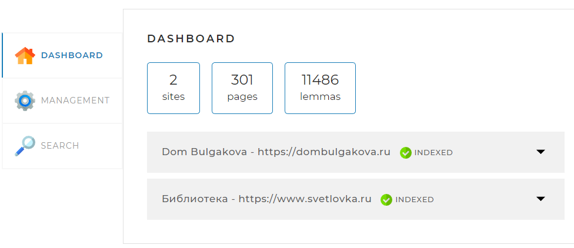
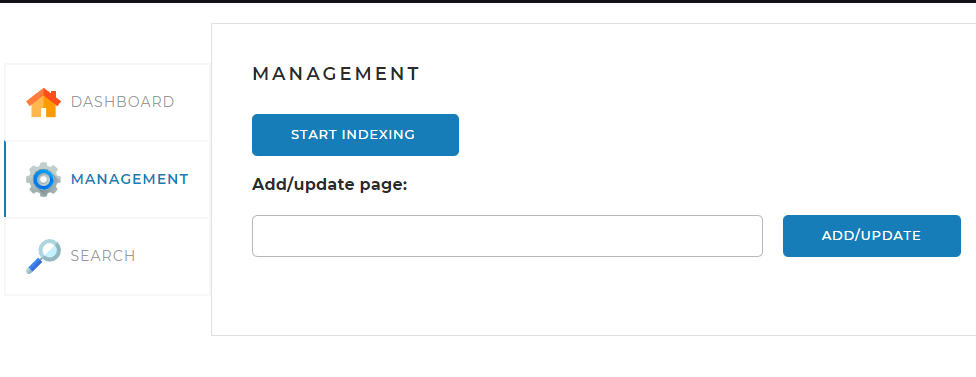
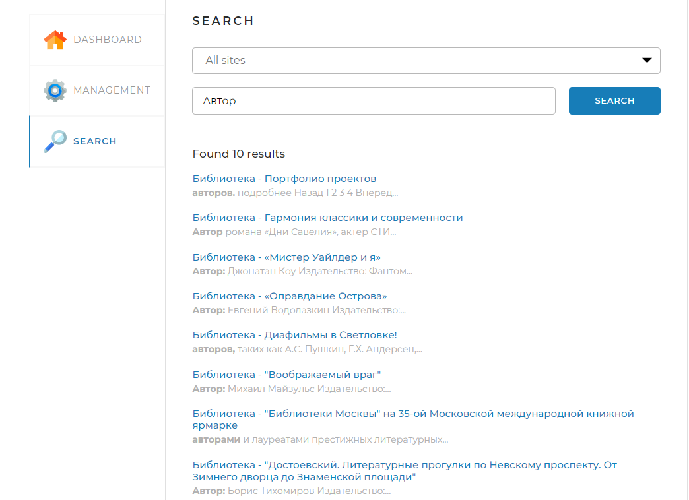

# Searchengine
Данный проект реализует поисковый движок, предоставляющий пользователю специальный
API со следующими основными функциями:
<li>предварительное индексирование сайтов;</li>
<li>выдача основных сведений по сайтам;</li>
<li>поиск ключевых слов в проиндексированных сайтах и предоставление их пользователю.</li>


## Принцип работы поискового движка:

<li>В конфигурационном файле перед запуском приложения задаются адреса сайтов, по которым движок должен осуществлять поиск.</li>

<li>Поисковый движок должен самостоятельно обходить все страницы заданных сайтов и индексировать их так, чтобы потом находить наиболее релевантные страницы по любому поисковому запросу.</li>

<li>Пользователь присылает запрос через API движка. Запрос — это набор слов, по которым нужно найти страницы сайта.</li>

<li>Запрос определённым образом трансформируется в список слов, переведённых в базовую форму. Например, для существительных — именительный падеж, единственное число.</li>

<li>В индексе ищутся страницы, на которых встречаются все эти слова.</li>

<li>Результаты поиска ранжируются, сортируются и отдаются пользователю.</li>


## Стэк используемых технологий
Java Core, Spring Boot, JPA, Hibernate, JDBC, Security, MySQL WorkBench, REST API, JSOUP, Maven, Git, JUnit


## Запуск приложения
Стартовая страница поискового движка находится по адресу : http://localhost:8080/ <br>
После запуска система запрашивает логин/пароль, которые указаны в файле конфигурации `\src\main\resources\application.yaml`:
```
 config:
  webinterfacelogin: admin
  webinterfacepassword: admin
```


## Окно авторизации для входа


## Главная страница
На главной странице выводится статистическая информация ("DASHBOARD"),
о проиндексированных сайтах и страницах,
а также леммах (начальная словарная форма слова), содержащихся на этих страницах.




## Страница индексации сайтов
На этой странице ("MANAGEMENT") находятся инструменты управления поисковым движком
Система позволяет производить как полную индексацию всех страниц на сайтов из списка, 
так и добавление и переиндексацию отдельно заданных страниц этих сайтов.




## Страница поиска
Эта страница ("SEARCH") предназначена для тестирования поискового движка.
На ней находится поле поиска и выпадающий список с выбором сайта, по которому искать, а при нажатии на кнопку SEARCH выводятся результаты поиска.




## Настройки проекта перед запуском
Для начала, необходимо создать локальный эмулятор в MySQL Workbench:


затем необходимо создать базу данных `search_engine`.


Указать логин/пароль, а также ссылку на базу данных для доступа можно в `application.yaml`
```
spring:
  datasource:
    url: jdbc:mysql://localhost:3306/search_engine
    username: root
    password: venom171249
  jpa:
    hibernate:
      ddl-auto: update
```


Для успешного скачивания и подключения к проекту лемматизатора из GitHub необходимо создать (либо отредактировать если он имеется - в Windows он располагается в директории C:/Users/<Имя вашего пользователя>/.m2) файл `settings.xml`, 
в котором указать токен для получения данных из публичного репозитория. В файл нужно внести следующие строки:
```
<settings xmlns="http://maven.apache.org/SETTINGS/1.0.0"
 xmlns:xsi="http://www.w3.org/2001/XMLSchema-instance"
 xsi:schemaLocation="http://maven.apache.org/SETTINGS/1.0.0
 https://maven.apache.org/xsd/settings-1.0.0.xsd">

<servers>
    <server>
      <id>skillbox-gitlab</id>
      <configuration>
        <httpHeaders>
          <property>
            <name>Private-Token</name>
            <value>wtb5axJDFX9Vm_W1Lexg</value>
          </property>
        </httpHeaders>
      </configuration>
    </server>
  </servers>
</settings>
```


Для работы системы в файле `pom.xml` необходимо добавить информацмию о фреймворке, если она уже добавлена, то ничего делать не нужно:
```
<parent>
        <groupId>org.springframework.boot</groupId>
        <artifactId>spring-boot-starter-parent</artifactId>
        <version>2.5.6</version>
        <relativePath/>
    </parent>
```
а также добавить ссылку на репозиторий для скачивания зависимостей лемматизатора:
```
<repositories>
<repository>
<id>skillbox-gitlab</id>
<url>https://gitlab.skillbox.ru/api/v4/projects/263574/packages/maven</url>
</repository>
</repositories>
```

Проверить, подключены ли к проекту следующие зависимости:
```
mysql-connector-java
spring-boot-starter-data-jpa
spring-boot-starter-thymeleaf
spring-boot-starter-web
spring-boot-devtools
spring-boot-starter-test
spring-security-test
spring-security-web
spring-security-config
jsoup
```

Для преобразования слов в леммы неообходимо проверить, подключенны ли зависимости:
```
<groupId>org.apache.lucene.morphology</groupId>
<artifactId>morph</artifactId>
<version>1.5</version>

<groupId>org.apache.lucene.analysis</groupId>
<artifactId>morphology</artifactId>
<version>1.5</version>

<groupId>org.apache.lucene.morphology</groupId>
<artifactId>dictionary-reader</artifactId>
<version>1.5</version>

<groupId>org.apache.lucene.morphology</groupId>
<artifactId>english</artifactId>
<version>1.5</version>

<groupId>org.apache.lucene.morphology</groupId>
<artifactId>russian</artifactId>
<version>1.5</version>
```

